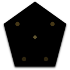
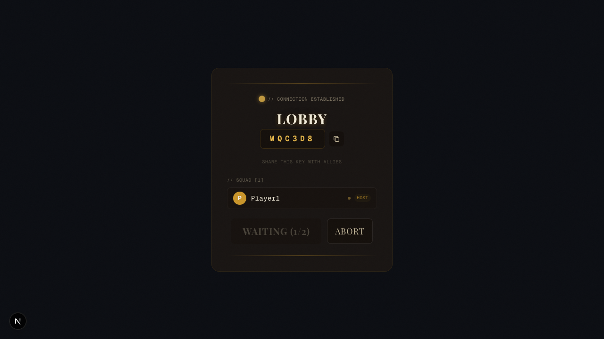
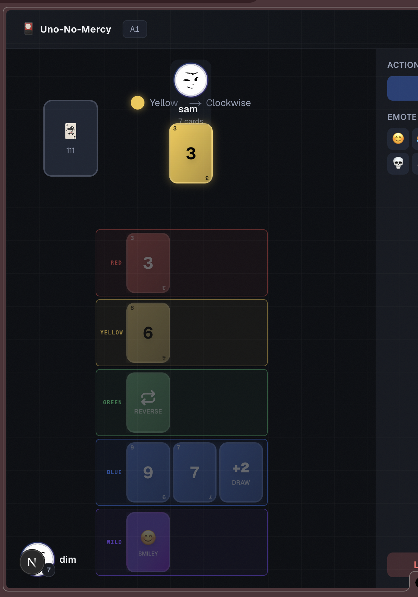

<div align="center">
  <br>
  
  <br>
  <h1 align="center">YOOBOO</h1>
  <p align="center">
    <strong>RAGE MODE</strong>
  </p>
  <p align="center">
    <em>Draw four. No take-backs. No excuses.</em>
  </p>
  <p align="center">
    <a href="https://github.com/CpBruceMeena/yooboo"><strong>github.com/CpBruceMeena/yooboo</strong></a>
  </p>
  <br>
</div>

<p align="center">
  
  &nbsp;
  
</p>

<br>

**YOOBOO** is a real-time multiplayer shedding-type card game with stacking penalties, special cards, and elimination. Last player standing with cards in hand wins — or the first to empty their hand.

Built with a server-authoritative game engine and Socket.IO communication.

## Quick Start

### Local development

Requires **Node.js 18+** and **nginx**.

### Docker (no local dependencies required)

Requires only [Docker](https://docs.docker.com/get-started/get-docker/).
See [Docker](#docker) section below.

### Install nginx (macOS)

```bash
brew install nginx
```

### 1. Install dependencies

```bash
npm install
cd server && npm install && cd ..
```

### 2. Start the servers

The app runs as 3 processes behind nginx. The easiest way is using the provided script:

```bash
./run.sh
```

This starts all 3 processes in tmux panes (or background if tmux unavailable):

| Process | Port | Description |
|---|---|---|
| nginx | 3000 | Entry point. Proxies Socket.IO to game server, HTTP + HMR to Next.js |
| Next.js | 3001 | Frontend (internal, dev mode with hot reload) |
| Game Server | 3002 | Socket.IO game engine (internal) |

By default, Next.js runs in **dev mode** (`next dev`) — source changes are reflected instantly.
To run in **production mode** (no hot reload, serves pre-built bundle):

```bash
PRODUCTION=1 ./run.sh
# or:
./run.sh build   # Build production bundle
PRODUCTION=1 ./run.sh
```

> **Note:** If a stale `.next/` build directory exists from a previous production run,
> the script now warns you and uses dev mode anyway. No more stale builds silently
> serving old code!

### 3. Manual start

```bash
# Terminal 1: nginx reverse proxy
nginx -c $(pwd)/nginx.conf -p $(pwd)

# Terminal 2: Next.js frontend
npm run dev

# Terminal 3: Game server (Socket.IO)
cd server && npx tsx index.ts
```

Open `http://localhost:3000` in two+ browser windows to play.

### 4. Play

1. Open `http://localhost:3000` in two+ browser windows
2. Enter a name and the same room code (or create from one window and join with the code in the other)
3. Click **Start Game** once everyone has joined

### Stop

```bash
./run.sh stop
```

Or manually:

```bash
nginx -s stop
pkill -f "tsx"
pkill -f "next"
```

### Commands

| Command | Description |
|---|---|
| `./run.sh start` | Start all servers (default) |
| `./run.sh stop` | Stop all servers |
| `./run.sh restart` | Stop then start |
| `./run.sh status` | Show running services |
| `./run.sh logs` | Tail logs from all processes |
| `./run.sh build` | Build Next.js production bundle |

### Environment Variables

| Variable | Description |
|---|---|
| `PRODUCTION=1` | Run Next.js in production mode (requires build first, or auto-builds) |
| `ALLOWED_ORIGINS` | Comma-separated origins for dev HMR WebSocket (e.g., ngrok URLs) |

## Docker

You can run the entire stack (nginx + Next.js + game server) in a single container with Docker.

### Prerequisites

- [Docker](https://docs.docker.com/get-started/get-docker/) installed and running

### Build & Run

```bash
# Build & start in one command:
docker compose up --build

# Or separately:
docker compose build   # Build image (2-3 min on first run)
docker compose up      # Start & follow logs

# Run in background:
docker compose up -d
```

Open `http://localhost:3000` to play.

### View logs

```bash
docker compose logs -f
```

### Stop

```bash
docker compose down
```

### How it works

The Docker image uses a 3-stage build:

| Stage | Purpose |
|---|---|
| `frontend-builder` | Installs root dependencies & runs `next build` |
| `server-deps` | Installs server production dependencies |
| `runner` | Combines everything + nginx into a runtime image |

Inside the container, the same 3-process architecture runs:

| Service | Port | Role |
|---|---|---|
| nginx | 3000 | Entry point (exposed to host) |
| Next.js | 3001 | Frontend (internal) |
| Game Server | 3002 | Socket.IO engine (internal) |

> **Note:** If you have local servers running (`./run.sh start`), stop them first with `./run.sh stop` before starting Docker — both use port 3000.

## Architecture

```
Client (Next.js + Tailwind v4) -------- HTTPS -------> nginx (:3000)
                                                            │
                                            ┌───────────────┼───────────────┐
                                            ▼                               ▼
                                     Socket.IO (/api/socketio)        Next.js (:3001)
                                     Game engine (pure TS)            UI rendering
                                            │
                                      - Authoritative validation
                                      - Card effects
                                      - Stack/smiley resolution
                                      - Elimination/win checks
```

- **nginx** (port 3000, reverse proxy): Entry point. Proxies `/api/socketio` to the game server and everything else (including WebSocket upgrades for Next.js HMR) to port 3001.
- **Game Server** (port 3002, Socket.IO): Owns all game state and validates every move.
- **Next.js** (port 3001, internal): Renders the frontend UI.
- **No database needed** — rooms are in-memory (ephemeral)

### Socket.IO Configuration

- **Transport**: WebSocket-first (`['websocket', 'polling']`) — faster handshake, falls back to polling if blocked
- **Path**: `/api/socketio` — nginx proxies this subpath to the game server
- **Timeout**: 15s initial connection, 10 reconnection attempts
- **No `forceNew`**: Avoids React Strict Mode double-mount interference

## Card Types

| Card | Effect |
|---|---|
| Number | Standard play, matches by value or color |
| Flip (Reverse) | Flip direction (2 players = skip, turn stays) |
| Double Tap (+2) / +4 / +6 / +10 | Add to draw stack |
| Power Surge (+4 Reverse) | Flip direction + stack +4 |
| Skip Everyone | Current player goes again |
| Discard All | Remove all cards of chosen color |
| Smiley 😊 | Stackable — next player plays smiley or draws until chosen color |

## Stack Rules

- Same card type stacks (+4→+4, +6→+6, etc.)
- **Smiley is stackable**: only smiley can be played on an unresolved smiley; color cards, +10, +6, etc. are blocked. Once resolved, any matching card can be played on the new top.
- Skip Everyone / Discard All cannot be played during stack
- If you can't stack → draw the full amount
- ≥25 cards = eliminated

## Project Structure

```
nginx.conf         nginx reverse proxy config (port 3000)
run.sh             Startup script (tmux/background, stale build detection)
src/
  lib/game/       Game engine (pure TS, shared with server)          hooks/          React hooks (useSocket, useGame)
  components/     UI components
  app/            Next.js pages (lobby + game)
server/
  index.ts        Game server entry (port 3002, Socket.IO)
  gameServer.ts   Authoritative game logic
scripts/
  smoke-test.mjs  Automated smoke test
```

## Rules

See [`RULES.md`](./RULES.md) for the complete game rules including card types, stacking mechanics, special cards (Smiley 😊, +4 Flip, +6, +10), elimination, and winning conditions.

## Disclaimer

YOOBOO is an independent card game inspired by the shedding-type card game genre.
YOOBOO is not affiliated with, endorsed by, or connected to Mattel, Inc.
UNO® is a registered trademark of Mattel, Inc.
